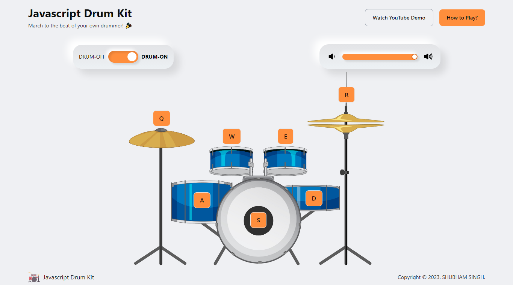
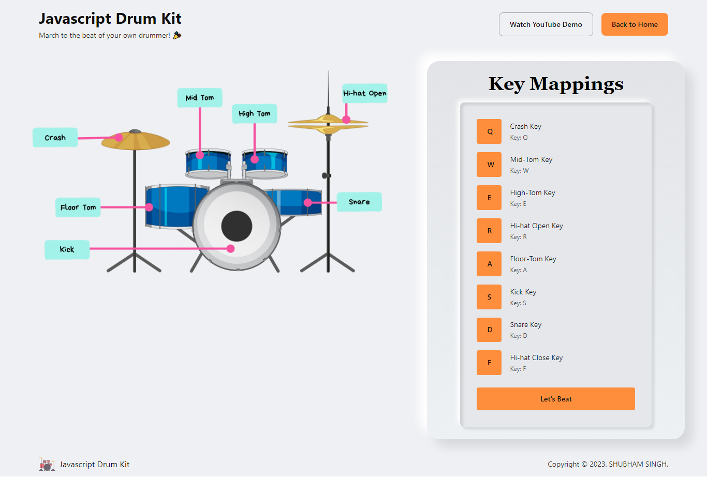

# React Drum Kit

## Description

A [**React Drum Kit**](https://js-drumplayer.netlify.app/) is an interactive musical instrument that allows users to play various
percussion sounds by clicking on different drum pads. The user interface is designed with a clean and
minimalist style, making it easy to use and visually appealing.

## Links for Project

- ### 📌 [LIVE Project Link](https://js-drumplayer.netlify.app/)

- ### 📌 [YouTube Link](https://youtu.be/enKgl7wf5cM)

## Tech Stack Used

## Features:

- Interactive drum pad buttons
- Sound playback on button press
- Mobile responsiveness
- Integration with React Router DOM for
  navigation
- Volume control with toggle switch and slider

### Image credits: <a href="https://www.freepik.com/free-vector/drum-set-musical-instrument_34266963.htm#query=music%20drums&position=42&from_view=keyword">Image by brgfx</a> on Freepik

## Installation and Setup Instructions

1. Clone down this repository. You will need `node` and `npm` installed globally on your machine.

2. Installation: `npm install`

3. To Start Server: `npm start`

4. To Visit App: `localhost:3000/`

## Project Screen Shot(s)

## Checkout Portfolio & Other Projects

### ⭐ [Personal Portfolio](https://shubhambhoj.in)

## Connect with Me

- [Mailto](mailto:shubhambhoj3@gmail.com)

- [LinkedIn](https://www.linkedin.com/in/shubham-singh-b122b7171/)

---

[GO TO TOP](#react-drum-kit)
